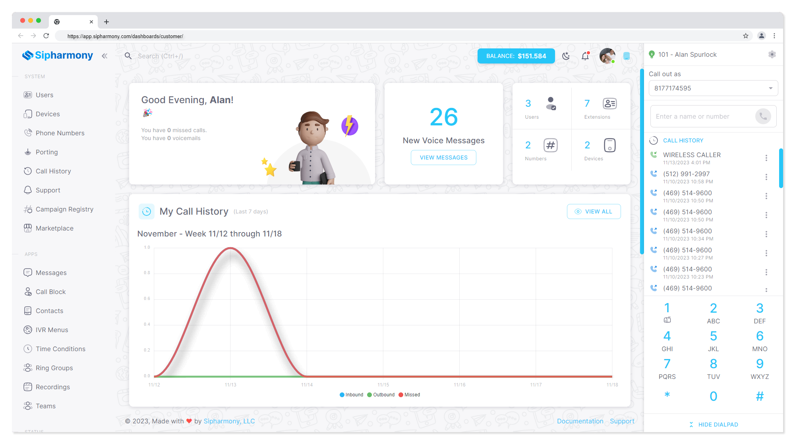

# Getting Started

Welcome to the Sipharmony documentation! This documentation is designed to help you get started with Sipharmony as quickly as possible. If you have any questions, please feel free to join our [discord server](https://discord.gg/H4sbDsd7Yp) and join the conversation!

:::info

This documentation is still a work in progress. If you have any questions, please feel free to joing our discord server and join the conversation!

:::

Let's discover **how easy it is to start communicating with Sipharmomy**.

Sipharmony is a comprehensive communication platform designed to streamline and simplify your communication needs. It offers a range of features including voice calls, video calls, and instant messaging, all in one easy-to-use interface.

## Registering a new account

[New Account](/docs/accounts/signup.md)
