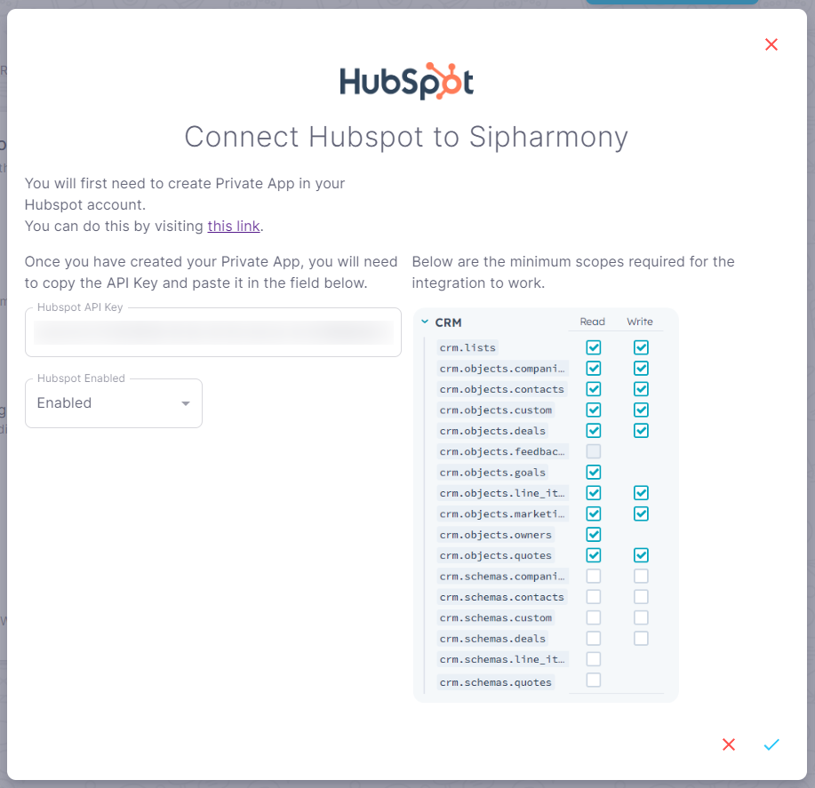

# Hubspot

## Overview

Use the Hubspot integration to get data about contacts, companies, deals, and tickets in your Hubspot account.

## How to integrate Hubspot with Sipharmony

1. Go to the [Hubspot integration](https://app.sipharmony.com/account-settings/connections/) page.
2. Click on the switch to enable the integration.

