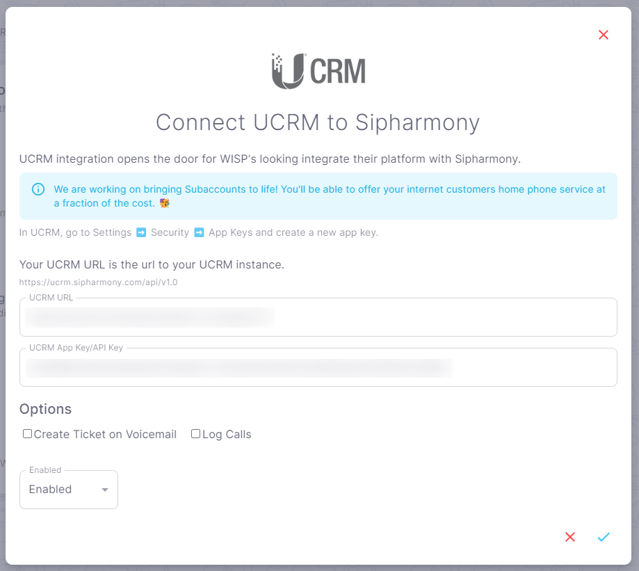

# UCRM Integration

## Overview

Use the UCRM integration to get data about clients, invoices, payments, and services in your UCRM account.

## How to integrate UCRM with Sipharmony

1. Go to the [UCRM integration](https://app.sipharmony.com/account-settings/connections/) page.
2. Click on the switch to enable the integration.

