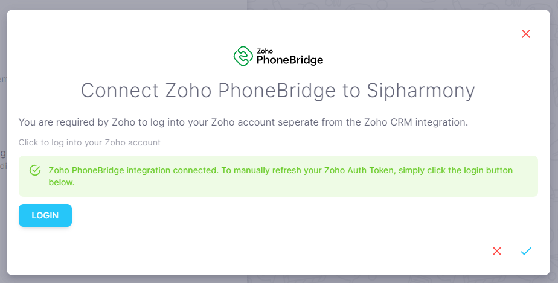

# Zoho Phone Bridge

## Overview

Use the Zoho Phone Bridge integration to track calls and SMS messages in your Zoho CRM account.

## How to integrate Zoho Phone Bridge with Sipharmony

1. Go to the [Zoho Phone Bridge integration](https://app.sipharmony.com/account-settings/connections/) page.
2. Click on the switch to enable the integration.

