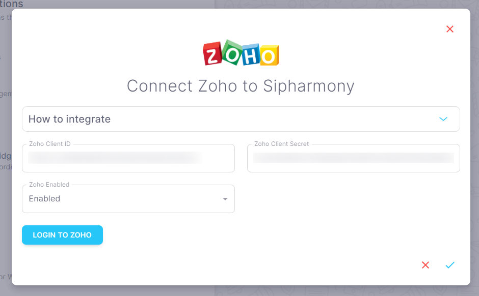

# Zoho CRM

## Overview

Use the Zoho CRM integration to get data about leads, contacts, and accounts in your Zoho CRM account.

## How to integrate Zoho CRM with Sipharmony

1. Go to the [Zoho CRM integration](https://app.sipharmony.com/account-settings/connections/) page.
2. Click on the switch to enable the integration.

