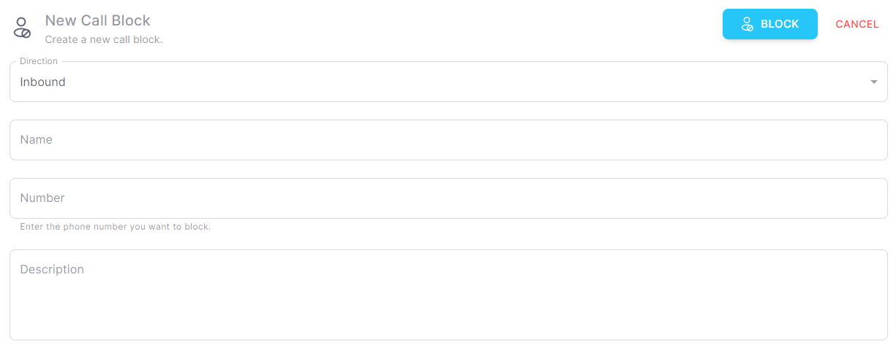

# Call Block

## Overview

Call block is a feature that allows you to block calls from specific phone numbers. For example, you can block calls from telemarketers.

## Creating a call block

1. Navigate to **APPS** > **Call Block** in the [Dashboard](https://app.sipharmony.com).
2. Click **Block A Number**.
3. Choose the direction to block. The following directions are available:
   - **Inbound** - Block inbound calls from the phone number.
   - **Outbound** - Block outbound calls to the phone number.
4. Enter the name of the call block.
5. Enter the phone number to block.
6. Enter a description for the call block.
7. Click **Block**.

You can also block a phone number from the call logs.
