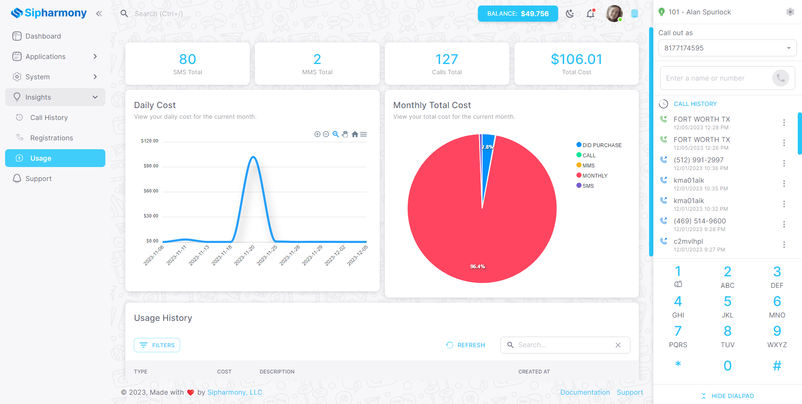
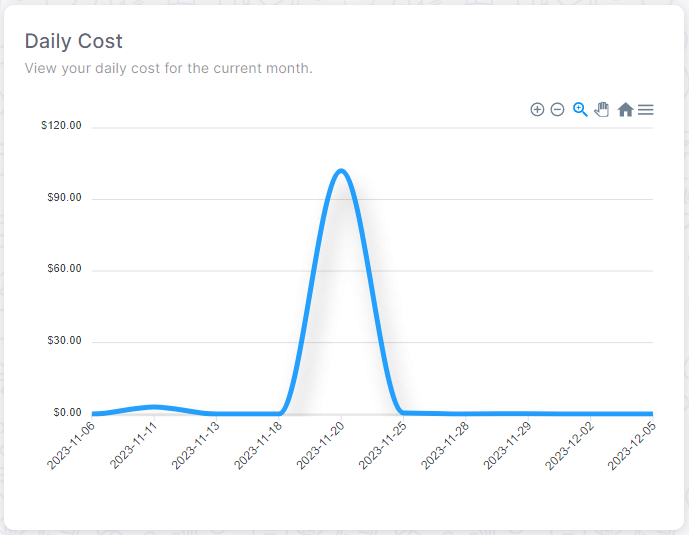
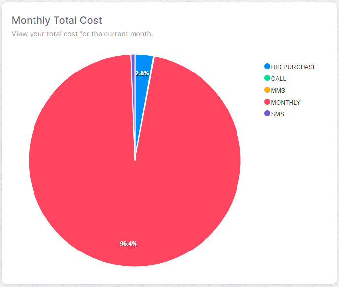
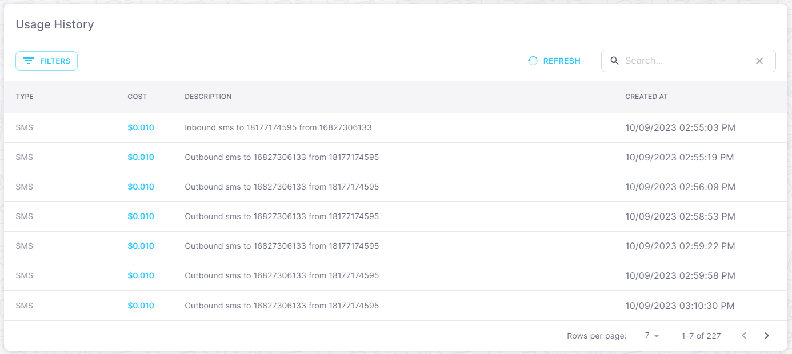

# View your accounts usage with ease

## Overview

You can view your accounts usage in the **Usage** section of the dashboard under **Insights**. This is a great way to see how many calls you have made and received.

You can also track your spending and see how much you have spent on calls, numbers, recordings, and text messages!

## Daily Costs

Daily costs show you how much you have spent on calls, numbers, recordings, and text messages for the current day. Presented to you in a beautiful graph.

## Monthly Costs

Monthly costs show you how much you have spent on calls, numbers, recordings, and text messages for the current month. Presented to you in a beautiful pie graph. Mmmmmm pie 🥧

## Usage History

Usage history table shows you how many calls you have made and received for the current month. You can also see how many text messages you have sent and received.

