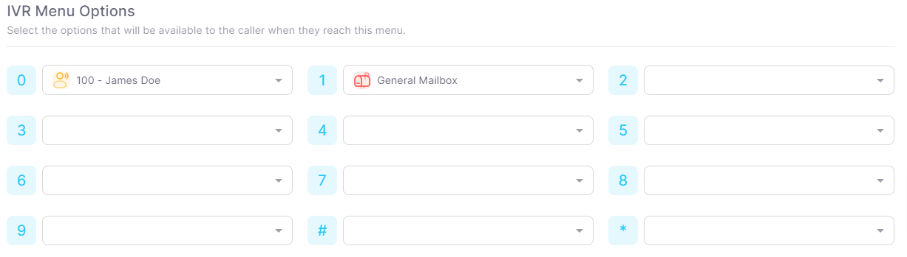
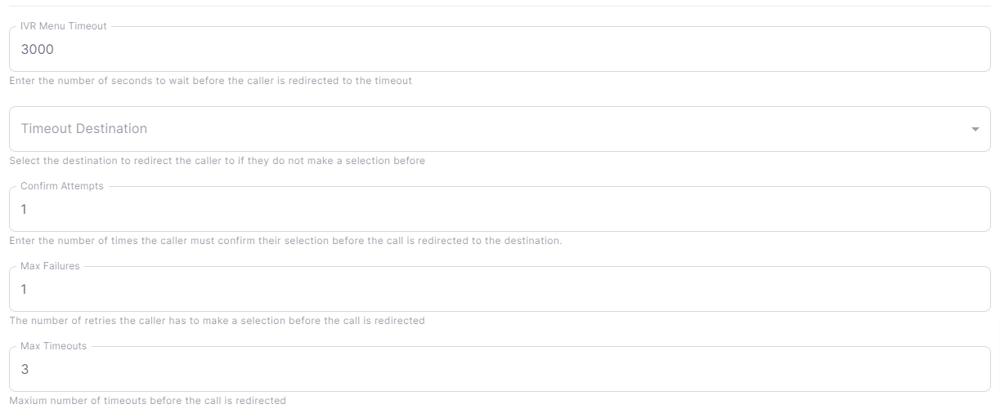

# Creating an IVR Menu

## Overview

An IVR menu is a menu that allows callers to select from a list of options using their phone's keypad. Each option can be configured to route to a different destination, such as a phone number, voicemail, or another IVR menu.

:::tip
It's recommended to have your recording created or uploaded before you create an IVR menu. You can read more about creating recordings [here](/docs/category/recordings).
:::

## Creating an IVR Menu

1. Navigate to **APPS** > **IVR Menus** in the [Dashboard](https://app.sipharmony.com).
2. Click **Create IVR Menu**.
3. Fill out the Name and Description fields.
4. Choose a greeting for your IVR menu.
5. Set your IVR Menu Options
6. Click **Save**.

:::info
To create a recording, navigate to **APPS** > **Recordings** in the [Dashboard](https://app.sipharmony.com).
You can read more about creating recordings [here](/docs/category/recordings).
:::

## IVR Menu Options

Each IVR menu option can be configured to route to a different destination. The following options are available:

- **Phone Number** - Route the call to a phone number.
- **Voicemail** - Route the call to a voicemail box.
- **IVR Menu** - Route the call to another IVR menu.
- **Call Queue** - Route the call to a call queue.
- **Conference** - Route the call to a conference room.
- **Hangup** - Hang up the call.
- **Playback** - Play a recording.
- **Text to Speech** - Play a text to speech message.
- **Direct Extension** - Route the call to a direct extension.
- **Dial by Name Directory** - Route the call to a dial by name directory.
- **Call Flow** - Route the call to a call flow.
- **Call Parking** - Route the call to a call parking lot.
- **Direct Extensions Voicemail** - Route the call to a direct extension's voicemail box.

## IVR Menu Settings

You can set various options for your IVR menu. The following settings are available:

- **IVR Menu Timeout** - The amount of time in seconds to wait for a caller to make a selection before timing out.
- **IVR Menu Timeout Destination** - The destination to route the call to if the caller does not make a selection before the timeout.
- **Confirm Attempts** - The number of times to confirm the caller's selection before routing the call.
- **Max Failures** - The number of times the caller can fail to make a selection before routing the call to the IVR Menu Timeout Destination.
- **Max Timeouts** - The number of times the caller can timeout before routing the call to the IVR Menu Timeout Destination.

