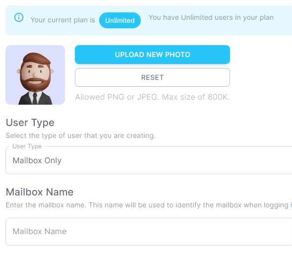

# Mailboxes

A mailbox is a place where voicemails are stored. You can have as many mailboxes as you like. You can also have as many voicemail greetings as you like. You can have a different voicemail greeting for each mailbox.

## How to create a mailbox

1. Log into your account
2. Click on **Users** in the left sidebar
3. Click on **Create User**
4. Under **User Type**, select **Mailbox Only**

:::tip

:::

## How to access your mailbox

You can access your mailbox in a number of ways:

1. Dial \*99\<mailbox number\> from your phone
2. Dial \*98 from your phone and enter your mailbox number when prompted
3. Logging into your account and clicking on Messages in the left sidebar
