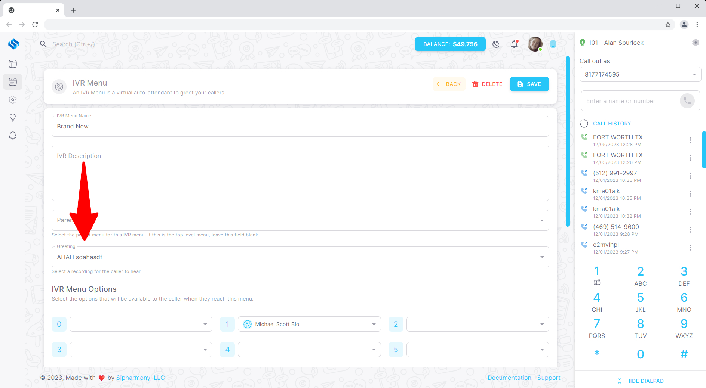

# Assign your recording to an IVR

## Overview

Once you have created a recording, you can assign it to an IVR. This is a great way to create a custom greeting for your IVR.

## Assigning a recording to an IVR

To assign a recording to an IVR, navigate to the **IVR Menus** page in the **Applications** section of the dashboard. Click the **Edit** button next to the IVR you want to assign the recording to.

Once you have selected your Greeting (Recording), click the **Save** button to save your changes.
