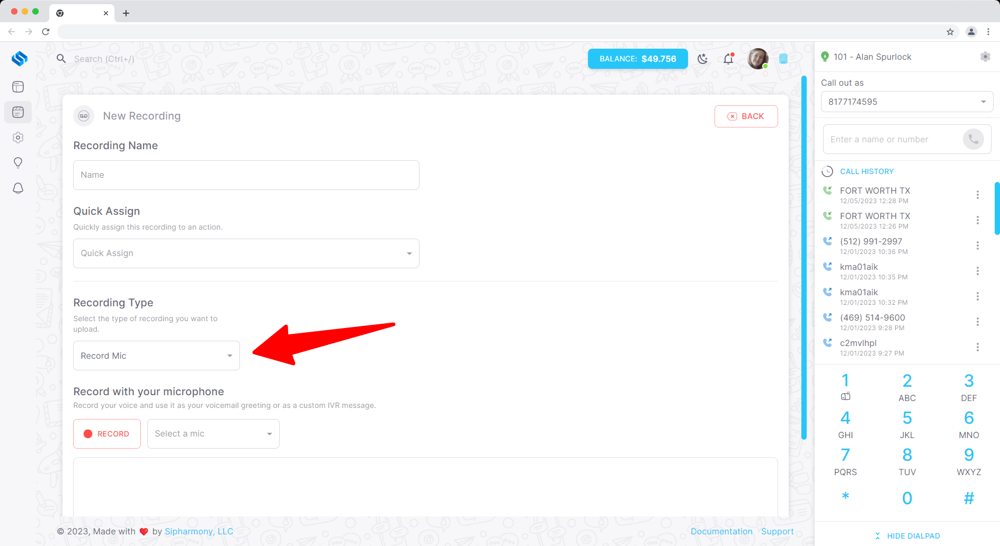
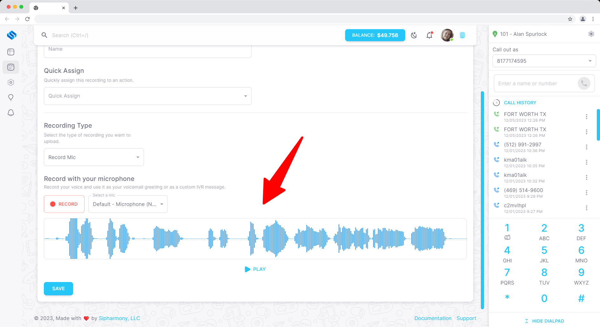

# Record from the dashboard

## Overview

You can record your own recording directly from the dashboard. This is a great way to create a recording without having to upload a file or use text to speech.

We are proud to say that not many providers offer this feature 😎

## Recording a recording

To record a recording, navigate to the **Recordings** page in the **Applications** section of the dashboard. Click the **Create** button and select **Record** from the dropdown menu.

After you select **Record**, you will be presented with options to configure your recording.

You can press the **Record** button to start recording. Once you are happy with the recording, press the **Stop** button to stop recording.

Once you are happy with the recording, simple click the **Create** button to create the recording.
