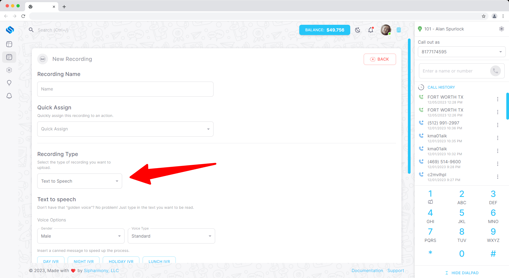
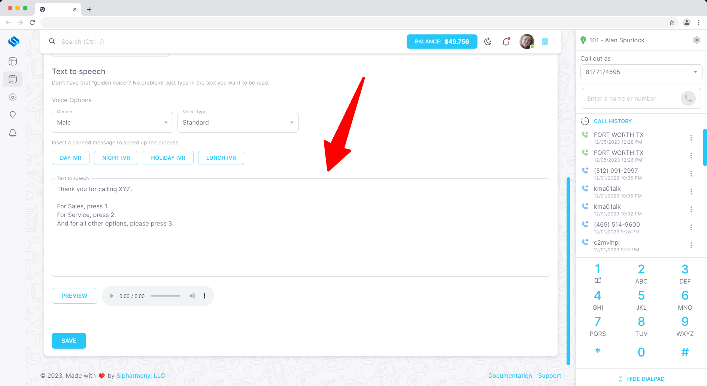

# Creating a Text to speech recording

## Overview

Text to speech recordings are a great way to create a recording without having to record your own voice. Text to speech recordings are generated by our system and are available in a variety of languages and voices.

## Creating a text to speech recording

To create a text to speech recording, navigate to the **Recordings** page in the **Applications** section of the dashboard. Click the **Create** button and select **Text to speech** from the dropdown menu.

You will be presented with a form to fill out with the details of your text to speech recording.

You can preview the text to speech recording by clicking the **Preview** button. Once you are happy with the recording, click the **Create** button to create the recording.
