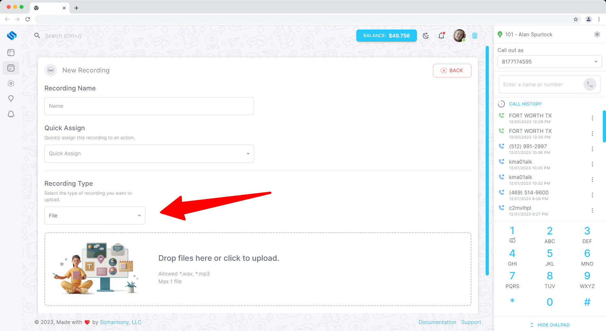
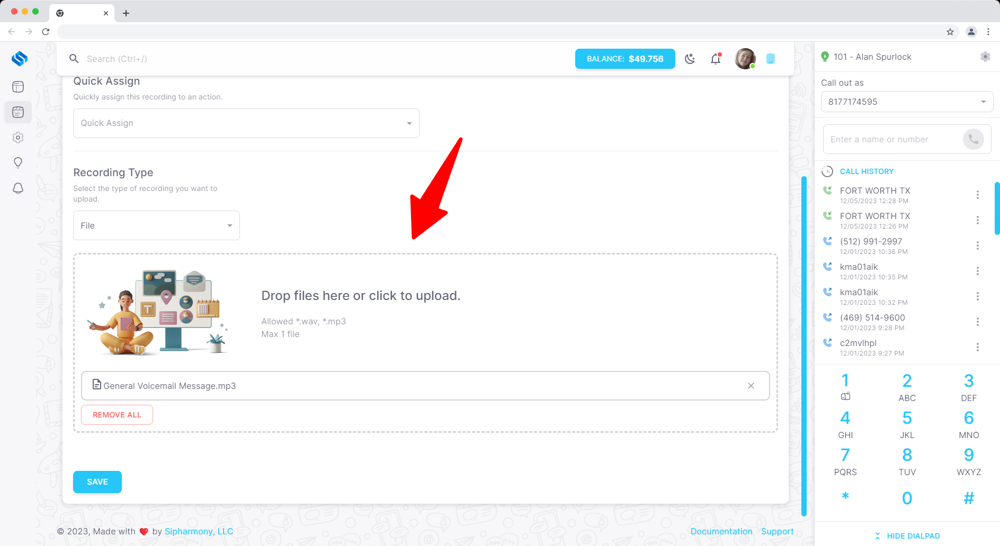

# Uploading your own recording

## Overview

Uploading your own recording is a great way to create a recording without having to record your own voice. You can upload a recording in a variety of formats.

The maximum file size for a recording is 5MB.

The following formats are supported:

- WAV
- MP3

## Uploading a recording

To upload a recording, navigate to the **Recordings** page in the **Applications** section of the dashboard. Click the **Create** button and select **Upload** from the dropdown menu.

Simply drag and drop your recording into the box or click the box to select a file from your computer.

You can preview the recording by clicking the **Preview** button. Once you are happy with the recording, click the **Create** button to create the recording.
