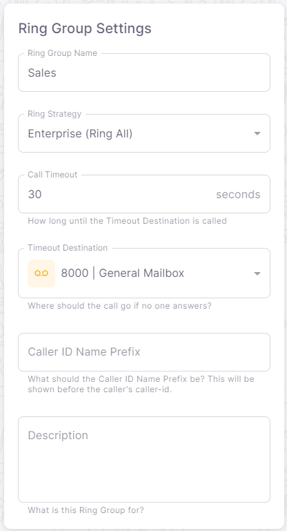
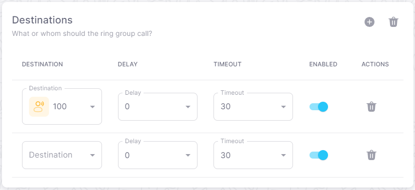

# Creating a Ring Group

## Overview

A ring group is a group of extensions that ring together when a call comes in. For example, you can create a ring group for your sales team. When a call comes in, all of the extensions in the ring group will ring at the same time.

You can also set various options for your ring group. For example, you can set the ring strategy to ring extensions in a specific order.

:::tip
You can create multiple ring groups to handle different scenarios. For example, you can create a ring group for your sales team and another ring group for your support team.
:::

## Creating a ring group

1. Navigate to **APPS** > **Ring Groups** in the [Dashboard](https://app.sipharmony.com).
2. Click **Create Ring Group**.
3. Fill out the Name and Description fields.
4. Set your ring group options.
5. Define your ring group members.
6. Click **Save**.

## Ring Group Settings

You can set various options for your ring group. The following settings are available:

- **Ring Strategy** - The strategy to use when ringing the ring group members. The following strategies are available:
  - **Enterprise (Ring All)** - Ring all ring group members at the same time.
  - **Sequential (Ring One By One)** - Ring the ring group members in the order they are listed.
  - **Roll Over (Ring One By One)** - Ring the ring group members in the order they are listed. If the first ring group member does not answer, ring the next ring group member.
  - **Random (Ring One By One)** - Ring the ring group members in a random order.
- **Call Timeout** - The amount of time in seconds to ring the ring group members before timing out.
- **Timeout Destination** - The destination to route the call to if the ring group members do not answer before the timeout.

## Ring Group Members

You can set various members for your ring group. The following members are available:

- **All destinations** - All destinations that are reachable.

