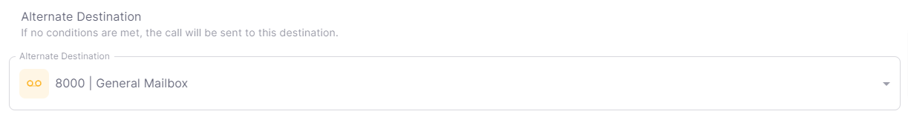
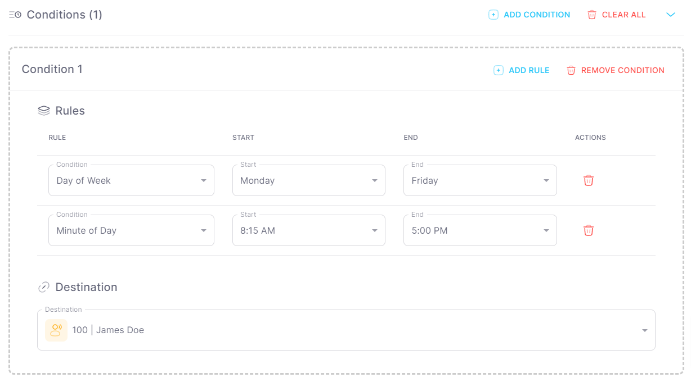

# Creating a time condition

## Overview

A time condition is a feature that allows you to route calls differently based on the time of day. For example, you can route calls to voicemail during non-business hours.

You can also use time conditions to route calls to different destinations based on the day of the week. For example, you can route calls to a call queue on weekdays and to voicemail on weekends.

Holdiays can also be configured to override the time condition's schedule. For example, you can route calls to voicemail on Christmas Day.

:::tip
You can create multiple IVR Menus to handle different scenarios. For example, you can create an IVR Menu for business hours and another IVR Menu for non-business hours. Or can
create an IVR Menu for weekdays and another IVR Menu for weekends. Holdiays can also be configured to override the IVR Menu's schedule.
:::

## Creating a time condition

1. Navigate to **APPS** > **Time Conditions** in the [Dashboard](https://app.sipharmony.com).
2. Click **Create Time Condition**.
3. Fill out the Name and Description fields.
4. Set your time condition schedule.
5. Set your time condition options.
6. Click **Save**.

## Alternate Destinations

You can set various alternate destinations for your time condition. This is called when the time condition is not active.

## Rules

You can set various rules for your time condition. The following rules are available:

- **Year** - The year to apply the time condition.
- **Month** - The month to apply the time condition.
- **Day of month** - The day of the month to apply the time condition.
- **Day of week** - The day of the week to apply the time condition.
- **Minute of day** - The minute of the day to apply the time condition.

## Destinations

You can set various destinations for your time condition. The following destinations are available:

- **Same destination as IVR Menus** - Use the same destinations as the IVR Menus.

