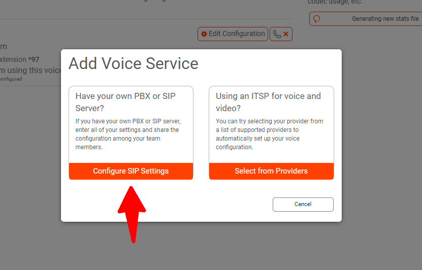
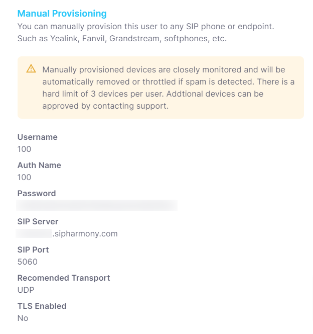
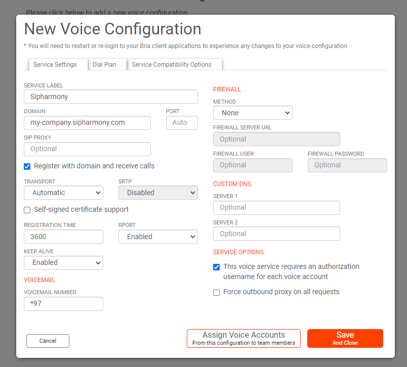
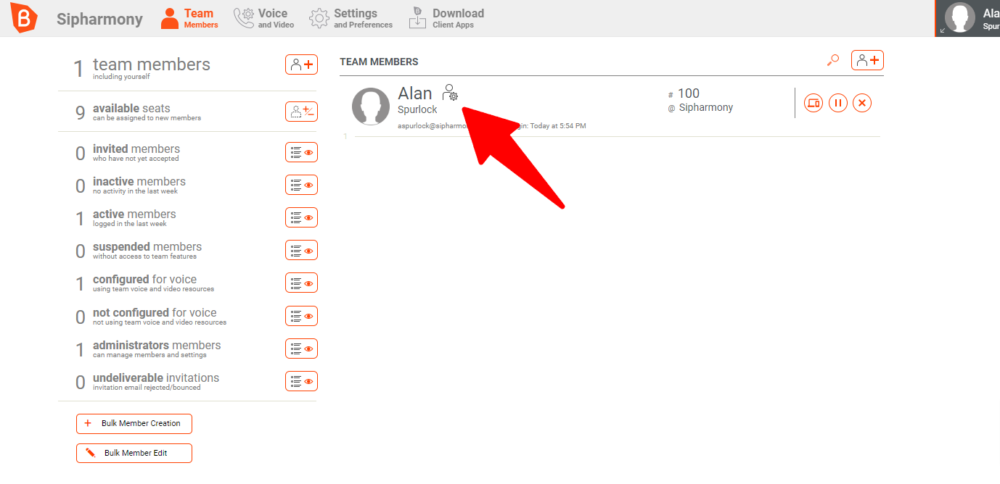
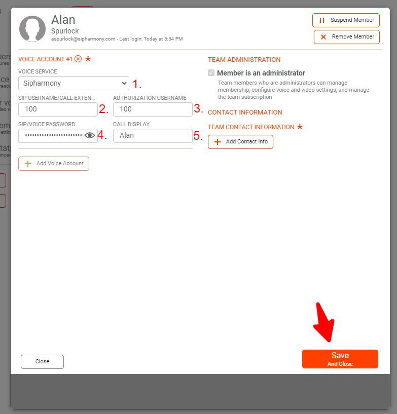

# Registering Bria Softphone

:::info
At this time, Bria **_DOES NOT support SMS/MMS_**. They also DO NOT support SIP SIMPLE SMS. This means that you will not be able to send or receive SMS/MMS with Bria. We are working on a solution to this problem. We will update this documentation once we have a solution. Hopfully Bria will add support for SIP SIMPLE SMS in the future. Zoiper, Microsip, and the Sipharmony Webphone all support SIP SIMPLE SMS.
:::

## Download Bria

You can download Bria from the [Bria website](https://www.counterpath.com/bria-solo/). You can also download Bria Teams from the [Bria Teams website](https://www.counterpath.com/bria-teams/).

## Registering Bria

Once you have downloaded Bria, you will need to register it with your Sipharmony account. To do this, you will need to log into to your Bria account and click on the **Voice and Video** tab.

Once you are there, you will need to click on **Add Voice Service**.

Once you have clicked on **Add Voice Service**, you will need to enter your SIP credentials. You can find your SIP credentials in your account dashboard under **Users**. Click on any user and then click on the **Provisioning** tab.

You will need to following information:

- SIP Server

Now in Bria, enter your information as follows:

- DOMAIN is your company domain. For example, if your company domain is `example.sipharmony.com`, then your DOMAIN is `example.sipharmony.com`.

Once you have entered your information, click on **Save and Close**.

Now you're ready to add your users to Bria. To do this, you will need to click on the **Team Members/Users** tab and click on your User/Team Member.

Once you have clicked on your user, you will need to configure your user. Each users configuration will be different.
Make sure you have the following information:

- SIP Username
- SIP Password
- SIP Authorization Username

Now in Bria, enter your information as follows:

Remember, you can find your SIP credentials in your account dashboard under **Users**. Click on any user and then click on the **Provisioning** tab.

## Bria Teams

Once you have all these steps completed, you will need to click on **Save and Close**.

Now you're ready to start making and receiving calls with Bria Teams!

You'll have to log out of Bria App (mobile and desktop) and log back in for the changes to take effect.
