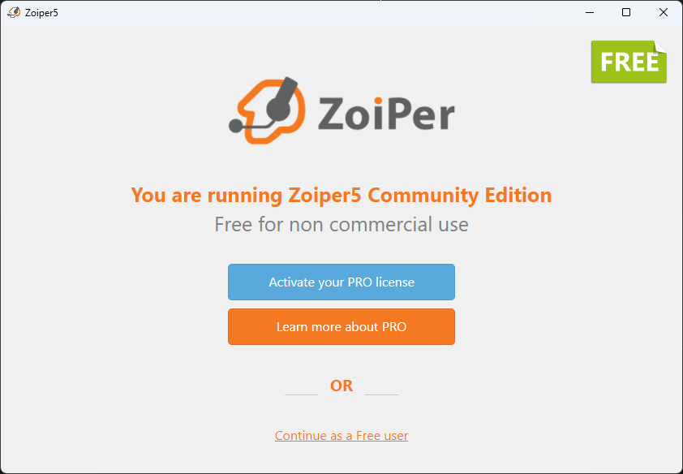
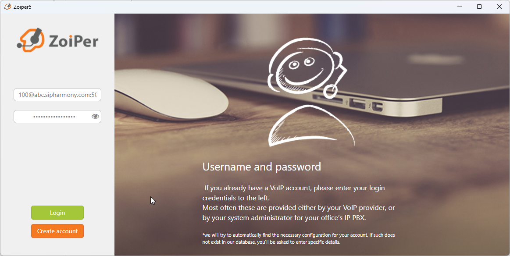
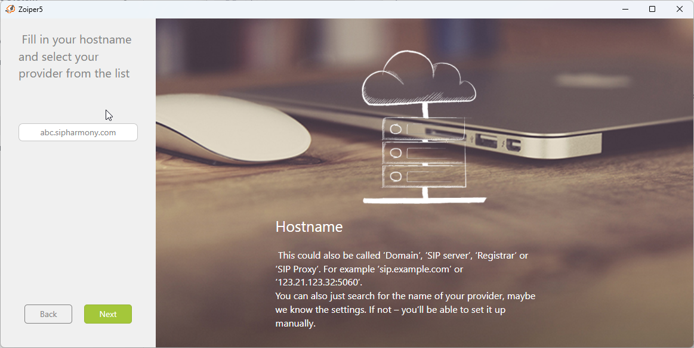
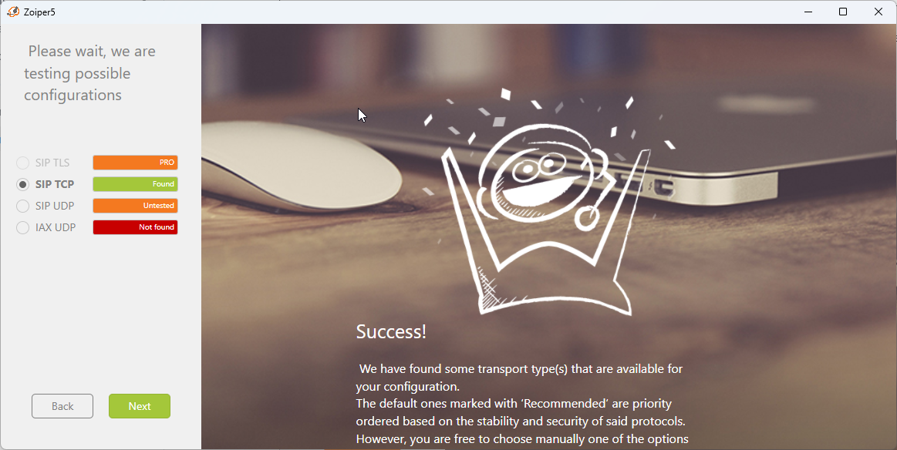

# Registering with Zoiper

:::info
Zoiper does support SMS through SIP SIMPLE! You will be able to send and receive SMS with Zoiper!
:::

:::warning
MMS is not supported by Zoiper.
:::

## Download Zoiper

You can download Zoiper from the [Zoiper website](https://www.zoiper.com/en/voip-softphone/download/current).

## Installing Zoiper5

Once you have downloaded Zoiper, you will need to install it. Once it is installed, you will need to open it.

## Registering Zoiper

If you have a PRO account, then log into your Zoiper account and click on **Add Account**.

If not, then click on **Continue as a Free User**.

Next you will need to enter your SIP credentials. You can find your SIP credentials in your account dashboard under **Users**. Click on any user and then click on the **Provisioning** tab.

If your user is 100 and your domain is abc.sipharmony.com, then you would enter `100@abc.sipharmony.com`

On the next screen, make sure your domain is correct and click on **Next**.

You can click **Skip** on Authentication Outbound Proxy.

Now Zoiper will test TLS, SIP TCP, SIP UDP, and IAX UDP. Once it is done, click on **Next**.

After this, you can continue to configure your zoiper account or skip it. It is up to you.

You should now be able to make and receive calls with Zoiper!

## Zoiper Mobile

Zoiper mobile is a great way to make and receive calls from your mobile device. It is a great alternative to the mobile and desktop apps. It is also a great way to make and receive calls from your computer if you don't have a headset or microphone.

We have made it super easy to register your Zoiper mobile app!

Simply log into your account and right there on the dashboard is a Zoiper QR code. Scan this QR code with your Zoiper mobile app and you're all set!
