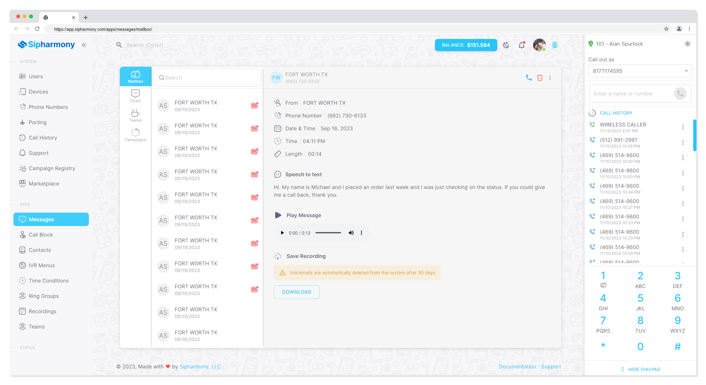
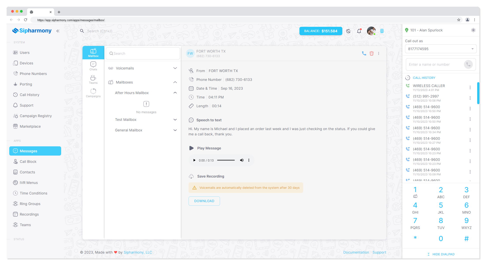
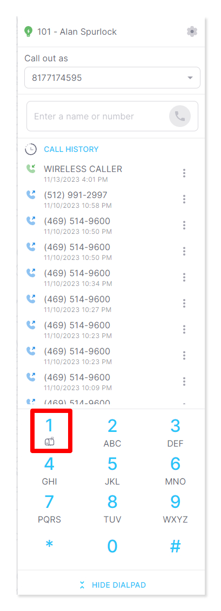

# Checking Voicemail

Checking your voicemail is easy. You can check your voicemail from your phone, or from the web portal.

## Checking voicemail from your phone

To check your voicemail from your phone, dial `*97` and follow the prompts.

If you have autoprovision setup, you can also press the voicemail button on your phone.

## Checking voicemail from the web portal

To check your voicemail from the web portal, log in to the portal and click on Messages -> Mailboxe tab.

From here, there are a few options:

- You can click Voicemails to see a list of your voicemails
- You can click Mailboxes to see a list of your mailboxes (if you have more than one) and click on the mailbox to see a list of voicemails for that mailbox

## Mailbox Messages

You can also check your mailbox messages from the web portal. To do this, click on Messages -> Mailbox Messages tab.

## Checking voicemail from the web dialer

You can also check your voicemail from the web dialer. To do this, click on the voicemail icon in the top right corner of the web dialer.

